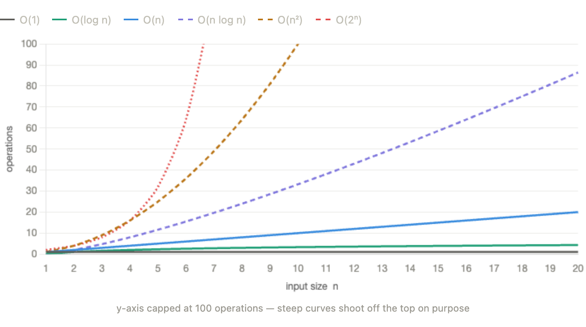
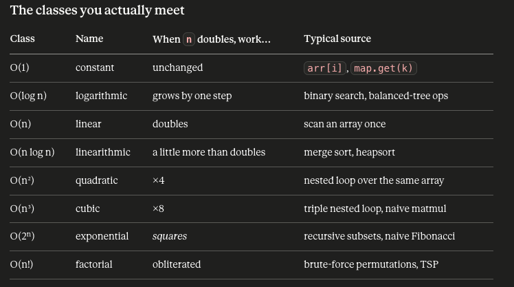

Big-O helps you define how an algorithm scales, there's 2 properties, first one would be time space which counts operations, second one would be space complexity which counts memory allocated

# Types of O(n) cases based on grow, from least to biggest

- O(1) - constant, the cost of the algorithm is the same, stale, consistent
- O(log n) - logaritmich, the grow os this algorithm is logaritmic based on the variable "n"
- O(n) - algebraic, the grow of this algorithm is proportional to the variable "n"
- O(n \* log n) - combination, the grow os this algorithm is the combination of the multiplication between the algebraic term and the logaritmich one
- O(n²) - algebraic term squared, the grow of this algorithm is the variable "n" squared
- O(2ⁿ) - exponential, the grow of this algorithm is exponential, it's the worst case scenario

Short summary of O(n), it's just how does the behavior of the algorithm changes, when "n" tends to infity. We focus on "growth" and not "speed", "speed" depends on the harware, machine, compiler, mood of the JIT etc...

## Analogy per algorithm cost

O(1) — grabbing one pre-plated dish from the fridge. 4 guests or 4,000, same effort.
O(n) — shaking every guest's hand. Work scales 1:1 with the guest list.
O(n²) — every guest clinks glasses with every other guest. Double the guests, quadruple the clinks.
O(log n) — finding a name in a sorted seating chart by repeatedly halving it.
O(2ⁿ) — trying every possible subset of guests to find the perfect table. Add one guest and the work doubles.

## Time vs Space

- Time complexity - how the operation count grows with "n"
- Space complexity - how much extra memory grows with "n" (input doesn't count)

Sometimes Fast just means "I bought speed with memory"

## How to analyze O(n) - 4 rules

1. Sequential blocks add: O(a) + O(b) = 0(max(a, b)).
2. Nested loops multiply: O(a) \* O(b).
3. Count work as a function of n, keep dominant, drop constants.
4. Recursion: set up a recurrence
